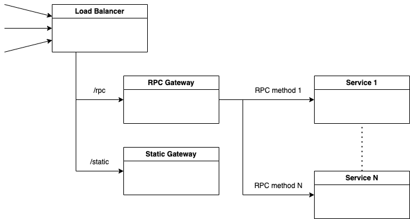

# Лабораторная работа №1

1. Работа должна быть опубликована на github.com
2. Ссылки на работу отправляем на адрес alex.matsuev@gmail.com (или в Telegram @alex_matsuev)
3. В описании работы обязательно указываем ФИО и номер группы

## Содержание работы

Проектируем структуру backend приложения:

1. Реализация распределения (балансировки) входящих запросов по эндпоинтам
2. Реализация протокола RPC для взаимодействия внутренних микросервисов
3. Реализация системы мониторинга (логи, метрики) с использованием Grafana

### Load Balancer (сервис балансировки)
- Должен принимать внешние запросы по протоколу HTTP
- POST запросы к эндпоинту /rpc проксируем в микросервис rpc-gateway
- GET запросы к эндпоинту /static проксируем в микросервис static-gateway

### RPC Gateway
- Должен принимать HTTP запросы с методом POST
- В теле запроса (body) передается JSON объект для вызова RPC метода:
```json
{
   "method":"<название RPC метода (функции)>",
   "data":{},
   "requestId":"<уникальный идентификатор запроса>"
}
```
- В поле "data" JSON-объекта передается набор параметров для выполнения
- В зависимости от названия метода, нужно проксировать запрос дальше в микросервис, который выполняет этот метод.
  
**ПРИМЕР**: допустим у вас есть функция, которая получает на вход массив чисел и суммирует все значения, тогда запрос может выглядеть вот так:
```json
{
   "method":"summ",
   "data":{
      "args":[1,5,-8,156,-24]
   },
   "requestId":"5545abec-aab1-4efa-80ef-b3491cb4b6c5"
}
```



